# 客户端使用说明

## 概述

### 简介

该版本客户端的适应系统有： win7 sp1 / win8 / win10。

客户端本身无需安装，进入[客户端页面](https://www.FRS.org/Download)，下载后直接双击 FRS-gui.exe，打开即可。使用过程中，如遇到任何问题导致客户端无法正常使用，请保留好客户端目录下的 error.log 文件，并与我们技术人员联系来解决问题。

> [!Note]
> Windows10 之前版本的系统需要安装 [.NET Framework 4.6.2](https://www.microsoft.com/net/download/framework) 。

### 同步

客户端需同步完才可以使用，即客户端界面左下角两边数值相同且保持相近速度稳步增加。

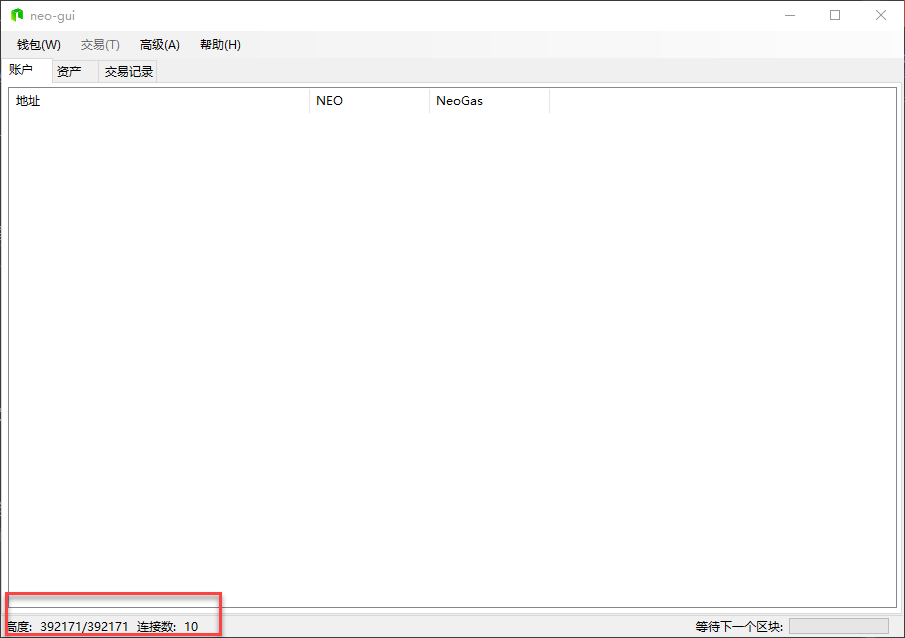

### 名词解释

#### 钱包

用来存储 FRS 账户及账户中资产信息的文件，也就是客户端的钱包数据库文件，一般以 .db3 作为后缀名称。该文件非常重要，需要 **安全备份**。

> [!Important]
>
> 钱包文件或钱包密码一旦丢失，将导致您资产的损失。所以请将钱包文件安全备份，妥善保管，并牢记钱包密码。

#### 账户

用户用于存储 FRS 区块链内资产的载体。

账户信息包括：地址、私钥、公钥、类型。

(1) 地址：相当于银行账户或银行卡号，用于交易时接收资产。

(2) 类型：FRS.Wallets.SignatureContract 表示该地址由一个公钥组成，是一个 1-of-1 多重签名地址。FRS.Wallets.MultiSigContract 表示该地址由多个公钥组成，是一个 m-of-n 的多重签名地址，该地址被用于智能合约当中。 

(3) 私钥：一个 256 位的随机数，由用户保管且不对外公开，是用户账户使用权以及账户内资产所有权的证明。 

(4) 公钥：每一个私钥都有一个与之相匹配的公钥（注：公钥、私钥信息右击地址，点击查看私钥可查看）

> [!Important]
>
> 任何时刻不要向他人泄露私钥，私钥一旦泄露，很可能会导致您资产的损失。

#### 资产

该账户所拥有的资产信息，资产信息包括：资产（FRS、FRSGas、用户所创设的资产）、类型、余额、发行者。

#### 交易记录

与该账户有关的全部交易信息的记录。

#### 转账

向对方进行资产转移，若资产类型为 Share，需双方签名确认，其他类型资产转账无需确认。

#### 交易

与对方进行资产交易，是一种线上的以物换物，需双方确认。

#### 签名

对信息进行签名，是对信息的一种确认。
用于交易、股权类资产分配及转账等需各方确认的场景。

#### 注册资产

在 FRS 区块链中创设一种新的用户发行资产。用户可以自己定义资产的类型、名称、总量等，并指定资产的管理员账户。创设资产需要消耗一定数量的 FRSGas 作为附加服务费，目前为 10000 FRSGas（测试网手续费为主网的百分之一）。

#### 分发资产

在资产创设所设定的总量上限范围内，向发行人指定的地址中发放该资产。分发资产需要消耗一定数量的 FRSGas 作为附加服务费，目前为 500 FRSGas（测试网手续费为主网的百分之一）。

#### 选举

想要成为 FRS 记账人的用户，需通过选举进行登记。通过消耗一定量的 FRSGas，获得候选记账人资格。目前记账人功能暂未开放，请等候通知。

#### 投票

FRS 持有者对候选记账人进行投票，根据投票结果，确定记账人。目前记账人功能暂未开放，请等候通知。

#### 广播

将签名后的交易信息发送到全网，由各节点进行确认，完成交易。目前这一功能只出现在签名里。

#### 监视地址

导入对方的地址作为监视地址后，便可以看到该地址上的资产情况。

## 钱包
### 创建钱包数据库

(1) 点击 `钱包` ， `创建钱包数据库`，弹出 `新建钱包` 页面。

(2) 点击 `浏览`，选定钱包文件存储位置，并设置好文件名称，然后点击保存。

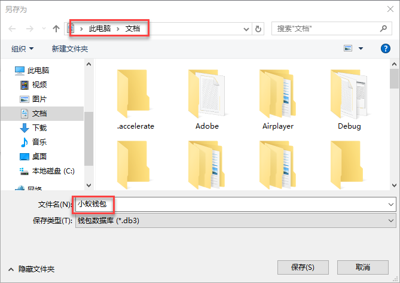

(3) 输入 `密码` 与 `重复密码` ，并保存好自己的密码。

(4) 点击 `确定` 后，钱包创建成功，此时钱包里会默认带有一个标准账户。需要注意的是，因找零机制的作用，转账后的剩余部分资产会默认转到第一个地址里，所以需备份好相应私钥与钱包。 

### 打开钱包数据库
(1) 每次重新打开客户端时，都需要点击 `打开钱包数据库` 来选择要打开的钱包。如图所示: 

(2) 点击 `浏览` 选择钱包（一般会默认为上一次打开的钱包），输入密码，点击确定后进入钱包。
需要注意的是，当钱包报错时，可以尝试选择在“修复模式”下打开钱包。

### 修改密码

可用来修改钱包密码。

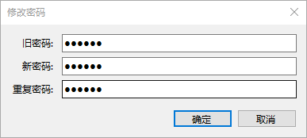

修改密码后请记得重新备份钱包，因为之前备份的钱包密码未变。

### 重建钱包索引

该选项用于恢复出现异常时客户端内有误的数据。在以下情况下可能需要重建钱包索引：

1、导入私钥后需要重建钱包索引。

2、某笔交易长时间未确认。

3、钱包内资产显示错误，与区块链数据不符。

目前区块高度较高，重建钱包索引大概需要较长时间，请耐心等待。

### 还原账户

该选项用于还原该钱包文件内被不小心删掉的地址及其上的资产。需要注意的是，一般不建议在客户端内进行删除操作，以免资产丢失。

## 交易

### 转账

#### 代币类资产转账

(1) 点击 `交易`，`转账`，`+` ，输入转账信息。

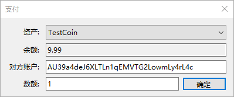

(2) 点击确定。

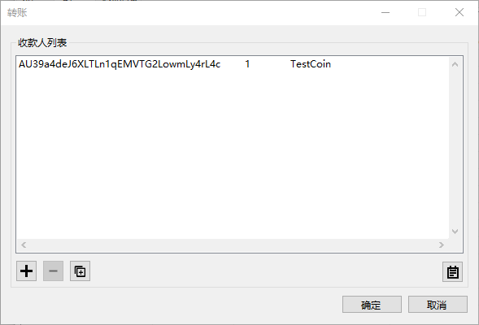

(3) 点击确定，如图所示:

#### 股权类资产转账

(1) 点击 `交易`，`转账`，`+` ，输入转账信息。

(2) 点击确定。

(3) 点击确定，如图所示显示需要更多签名： 

(4) 签名功能具体见 [签名](#sign) 。 

#### 批量转账

该功能用于简化对同一资产向不同地址转账的操作。

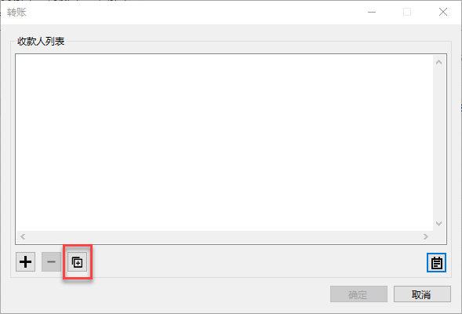

数据格式为 `地址 转账金额`（中间以空格分隔）。 

需要注意的是，数据格式应严格按照上述标准，多余的空格很可能导致转账失败。

#### 备注

该功能用于将此次交易的备注信息记录到 FRS 区块链上，目前在 [FRS 区块链浏览器](https://www.antchain.xyz/) 可以查到相应的备注信息。 

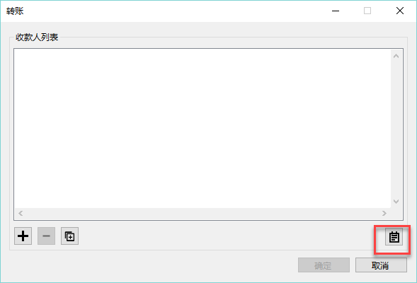

备注信息格式目前无要求。

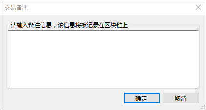

在浏览器上可以查到的备注。 

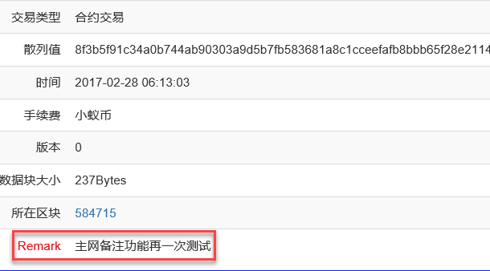

### 交易

#### 发起交易

(1) 交易需对方各自发起交易请求，确定将要发送给对方的资产详情。 

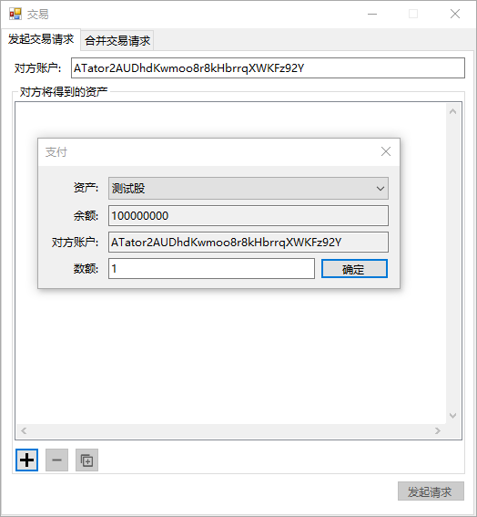

(2) 点击确定，生成交易请求。我们可以根据交易请求得知对方的发送详情。 

#### 合并交易

(1) 关闭发起的交易请求窗口后，就会跳转到合并交易请求界面。 

(2) 将对方发过来的交易请求粘贴上去，点击验证，验证对方请求是否合法，若合法，可选择接收或拒绝。

(3) 若点击接受，则之后需要双方签名并广播。具体操作见 [签名](#sign) 。

### 签名 
(1) 将对方发来的需要签名的交易信息粘贴在输入框内，点击 `签名`，生成输出数据，同时 `广播` 按钮显示出来。 

(2) 点击 `广播` 后，交易成功发送，等待确认后便可完成该笔交易。

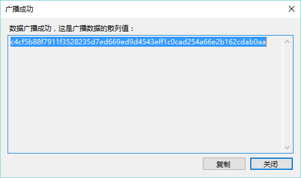

## 高级

### 离线同步包使用说明

**下载离线同步包**

离线数据包下载网址：https://www.FRS.org/client/chain.acc.zip

输入网址，你会下载到一个压缩包。

**添加离线同步包**

将离线数据包解压后（即为 chain.acc）放入文件夹内，如下图所示：

**开始离线同步**

打开客户端，即可发现客户端以超快的速度进行同步中，如下图所示：

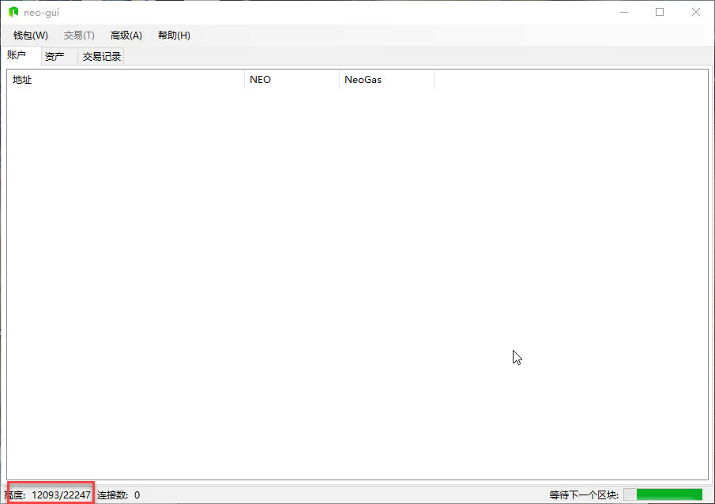

**离线同步完成**

同步完相应的区块后，文件 chain.acc 即消失，如下图所示。此时，客户端接着离线数据同步完成的部分继续同步，同步速度减慢。

### 多方签名地址

多方签名地址是由多个公钥组成的，需要一方或多方签名的合约地址。   

右击账户页面空白处，选择`创建合约地址`，`多方签名`，在下方的文本框中依次输入各个公钥，设定`最小签名数量`，如下图所示：    

即可成功创建出合约地址，并出现在账户页面中，如下图所示：    

### 提取 FRSGas

FRSGas 伴随着每个新区块的生成而产生，会按照 FRS 的持股比例，记录在 FRS 地址上（资产余额中的括号里的数目即为待认领的 FRSGas 数目）。FRS 持有人可以在任意时间进行发起一笔认领交易，将这些 FRSGas 认领到 FRS 的地址上。目前只有 PC 版客户端拥有提取 FRSGas 的功能。

具体操作步骤为：

(1) 对钱包中的所有 FRS 进行一次转账操作（可以直接转到目前地址），待认领的 FRSGas 才会结算一次，变得可提取（具体原理见白皮书）。

(2) 点击 `高级`，`提取 FRSGas`，`全部提取`，提取完成。

### 申请证书

注意，该功能只可以生成一个证书申请文件，用户仍需去相关数字证书颁发机构申请证书。
点击 `高级`，`申请证书`，然后填写证书申请向导。

最终会生成一个如下图所示的文件：

### 注册资产

资产类型有两种，Token 和 Share（转账时需要双方签名）。此处以 Token 为例，填写如下：     

注册资产通过调用智能合约来完成，如下图所示，点击`试运行`，即可看到所需手续费详情：         

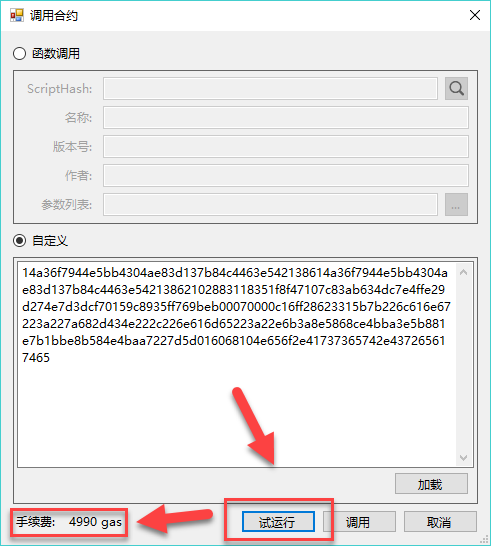      

同时，您也可以选择加载本地写好的智能合约文档。     

需要注意的是，注册资产需花费大量手续费（目前为 4990FRSGas），请谨慎操作。     

### 分发资产

分发资产需在`资产 ID`中输入注册资产的交易 ID，如下图所示：      

      

需要注意的是，分发资产需花费手续费（目前为 1FRSGas），请谨慎操作，可以选择一次性分发完毕。      

### Deploy Contract

待补充

### Invoke Contract

待补充

### 选举

该功能用于报名成为 FRS 区块链记账人候选人。   

     

选举同样通过调用智能合约来完成，如下图所示，点击`试运行`，即可看到所需手续费详情：      

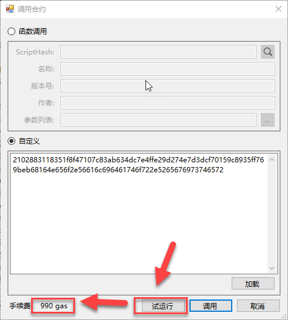      

同样地，您也可以选择加载本地写好的智能合约文档。    

需要注意的是，选举需花费大量手续费（目前为 990 FRSGas），请谨慎操作。目前记账人权限暂未开放，请等候通知（计划之内）。   

### 投票

成为候选人之后，即可通过投票来竞选成为记账人，如下图所示：      

     

投票同样通过调用智能合约来完成，如下图所示，点击`试运行`，即可看到所需手续费详情：     

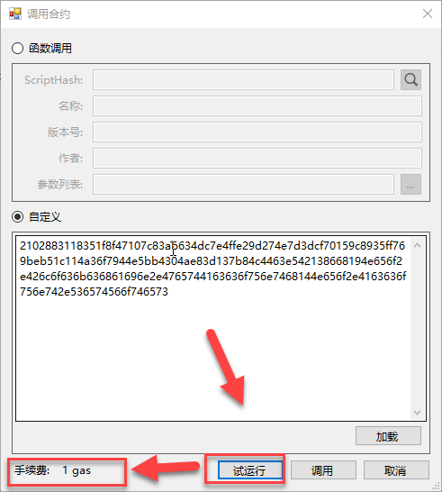      

同样地，您也可以选择加载本地写好的智能合约文档。    

需要注意的是，投票需花费手续费（目前为 1FRSGas），请谨慎操作。目前记账人权限暂未开放，请等候通知（计划之内）。    

### 选项

暂无内容。

## 帮助

### 查看帮助

暂无内容。

### 官网

点击后将会跳转到 FRS 官网。

### 开发人员工具

待补充

### 关于 FRS

FRS 客户端的版本号。
